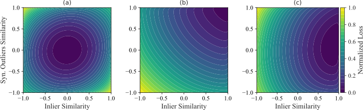

# Learning Compact and Robust Representations for Anomaly Detection


## Overview
Distance-based anomaly detection methods rely on compact and separable in-distribution (ID) embeddings to establish clear anomaly boundaries. Vanilla contrastive objectives suffer from class collision and promote unnecessary intraclass variance within ID samples. Similarly, supervised objectives fail to account for the semantic variability of synthetic outliers, weakening contrastive signals and leading to representation collapse. We propose FIRM as a contrastive pretext task for anomaly detection that encourages compact ID embeddings while enhancing the diversity of synthetic outliers to ensure a robust feature space and address these limitations. Extensive ablation studies confirm FIRM’s advantages over existing contrastive objectives. FIRM achieves 40× faster convergence than NT-Xent and 20× faster than SupCon, with superior performance. On CIFAR-10, FIRM delivers an average performance boost of 6.2% over NT-Xent and 2% over SupCon, with class-specific improvements of up to 16.9%.

In this repository, we provide the code used to run the experiments presented in the paper.

## Reproducing the Experiments

To replicate the experiments on datasets like CIFAR-10, you can run the provided scripts from the root directory using the following commands:
```bash
./scripts/cifar10.sh
```
For experiments utilizing OE, simply include `--oe 300k`:

```bash
./scripts/cifar10.sh --oe 300k
```

All results, including model checkpoints and evaluation logs, will be automatically saved in the following directory structure:
```bash
save/{dataset_name}_models/{experiment_name}/trial_{trial_number}/
```

## Citation
This work (and repository) is private and currently under double-blind review.
